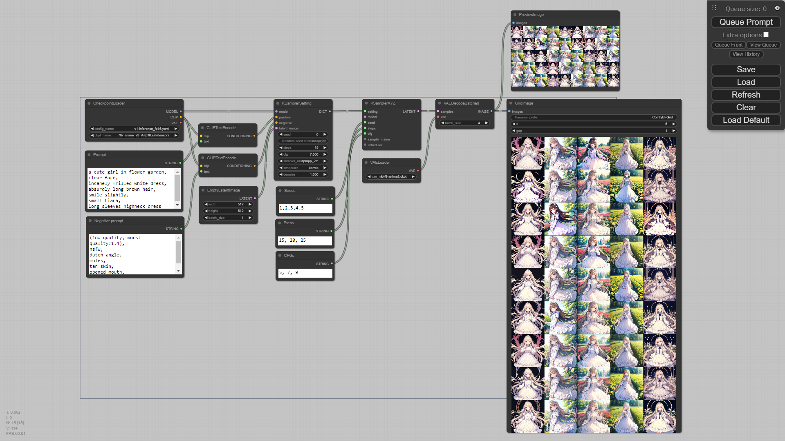
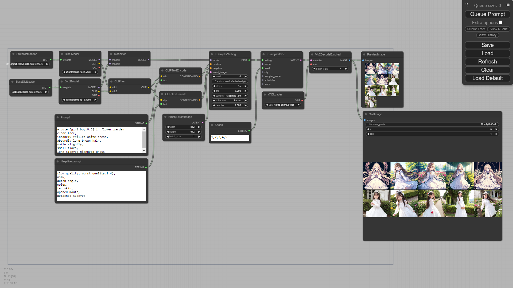
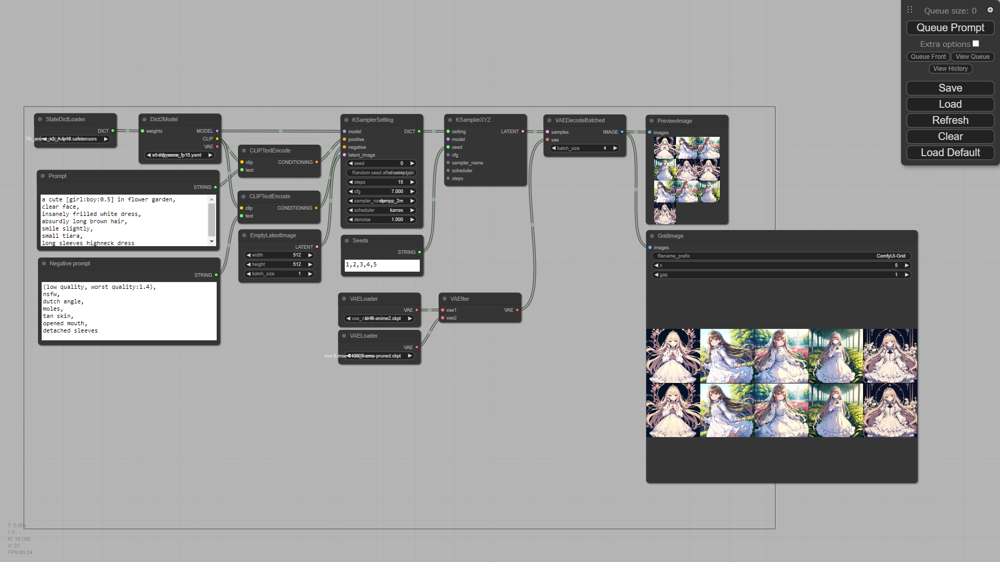
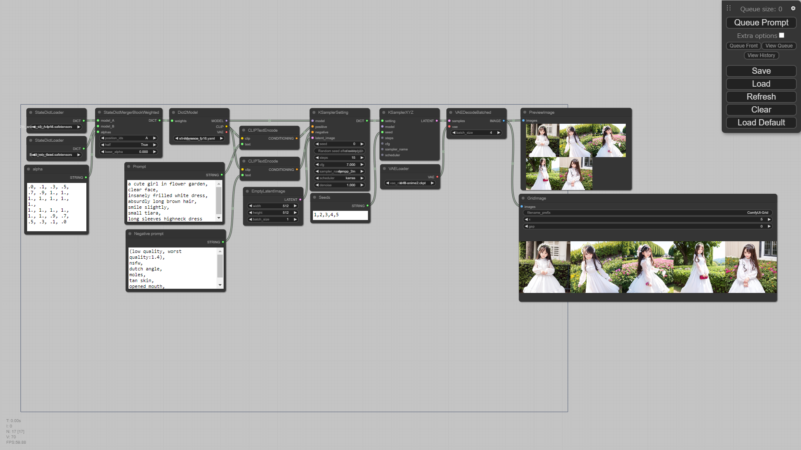
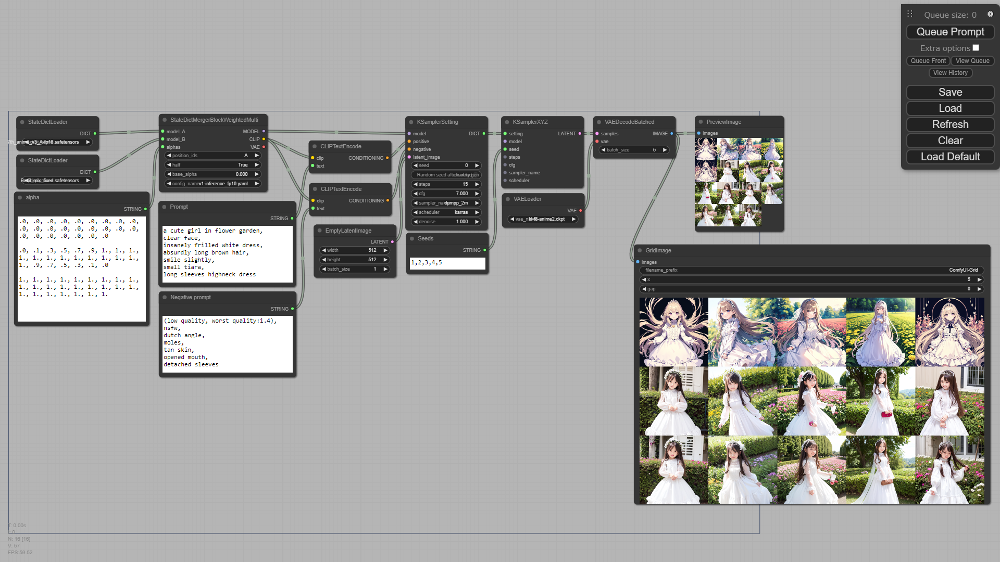

# ComfyUI custom nodes

## Examples

### X/Y/Z-plot

seeds, steps, cfg scales and others

[workflow link](./examples/workflow_xyz.json)

models

[workflow link](./examples/workflow_xyz_model_clip.json)

VAEs

[workflow link](./examples/workflow_xyz_vae.json)

### Merge

simple merge and [merge block weighted](https://github.com/bbc-mc/sdweb-merge-block-weighted-gui) (thanks for @bbc-mc)

#### BMW

[workflow link](./examples/workflow_mbw.json)

#### Multi-BMW

BMW with multi-alpha like [supermerger](https://github.com/hako-mikan/sd-webui-supermerger/) (thanks for @hako-mikan)

[workflow link](./examples/workflow_mbw_multi.json)

## Node List

### Latent nodes

|category|node name|input type|output type|desc.|
| --- | --- | --- | --- | --- |
|latent|RandomLatentImage|`INT`, `INT`, `INT`|`LATENT`|(width, height, batch_size)|
|latent|VAEDecodeBatched|`LATENT`, `VAE`, `INT`|`IMAGE`|VAE decoding with specified batch size|
|latent|VAEEncodeBatched|`IMAGE`, `VAE`, `INT`|`LATENT`|VAE encoding with specified batch size|
|latent|LatentToImage|`LATENT`, `FLOAT`, `FLOAT`|`IMAGE`|convert 4-ch latent tensor to 4 grayscale images|
|latent|LatentToHist|`LATENT`, `...`|`IMAGE`|create a histogram of the input latent|

### Sampling nodes

|category|node name|input type|output type|desc.|
| --- | --- | --- | --- | --- |
|sampling|KSamplerSetting|`MODEL`, `CONDITIONING`, `CONDITIONING`, `LATENT`|`DICT`|aggregate sampler's setting to single dict|
|sampling|KSamplerOverrided|various|`LATENT`|override sampler's setting defined by `KSamplerSetting`|
|sampling|KSamplerXYZ|various|`LATENT`|generate latents with values|

### Model nodes and Loader nodes

|category|node name|input type|output type|desc.|
| --- | --- | --- | --- | --- |
|loader|StateDictLoader|(model name)|`DICT`|load state_dict|
|model|Dict2Model|`DICT`, (config_file)|`MODEL`|instantiate a model from given state_dict|
|model|StateDictMerger|`DICT`, `DICT`, `FLOAT`|`MODEL`, `CLIP`, `VAE`|merge two or three models|
|model|StateDictMergerBlockWeighted|`DICT`, `DICT`|`DICT`|merge two models with per-block weights|
|model|StateDictMergerBlockWeightedMulti|`MODEL`, `MODEL`, `STRING`|`MODEL`, `CLIP`, `VAE`|merge two models with per-block weights|
|model|ModelIter|`MODEL`, `MODEL`|`MODEL`|iterate models|
|model|CLIPlIter|`CLIP`, `CLIP`|`CLIP`|iterate CLIPs|
|model|VAElIter|`VAE`, `VAE`|`VAE`|iterate VAEs|

### Output nodes

|category|node name|input type|output type|desc.|
| --- | --- | --- | --- | --- |
|image|GridImage|||generate single image with specific number of columns|
